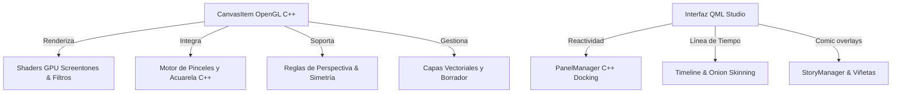

# 🎨 Kromo / ArtFlow Studio Pro — Registro de Funcionalidades Completadas

Este documento recopila y certifica de manera técnica y estructurada todas las funcionalidades, motores de simulación y paneles de interfaz que **ya se encuentran 100% desarrollados, optimizados y operativos** en el código base del proyecto (subsistemas en **C++** y vistas en **QML**). 

---

## 🚀 Resumen del Núcleo Tecnológico Activo
El software combina un motor de renderizado de alto rendimiento en **C++ con aceleración OpenGL** y una interfaz fluida en **QML/QtQuick** que gestiona de manera reactiva el espacio de trabajo.

---

## 🎨 1. Motor de Dibujo e Ilustración (C++ Core)
Esta es la columna vertebral de la aplicación, implementada nativamente en C++ para garantizar latencia cero y precisión en pantallas de dibujo profesionales.

### 🖌️ Motor de Pincel y Dinámicas de Presión
- **Motor de Pinceles Photoshop (`brush_engine.h`):** Procesamiento de dinámicas de presión y ángulo del lápiz táctil en tiempo real.
- **Pinceles Duales y Texturas:** Capacidad de combinar dos puntas de pincel simultáneas y aplicar texturas secas/húmedas controladas por presión.
- **Simulador de Acuarela Avanzado (`watercolor_engine.h`):** Algoritmo físico de difusión de pigmentos y flujo dinámico para simular pinceladas húmedas y secas realistas.

### 📐 Ayudas de Dibujo Activas
- **Reglas de Perspectiva Pro (`PerspectiveRuler.h`):**
  - Soporte matemático nativo para guías y rejillas de **1, 2 y 3 puntos de fuga**.
  - Sistema de **atracción magnética (snapping)** del trazo que fuerza a las pinceladas del artista a converger de forma perfecta hacia los puntos de fuga activos.
  - Puntos de fuga arrastrables interactivamente en el lienzo mediante ratón o lápiz táctil.
- **Simetría Dinámica Multieje:**
  - Modos de espejo **Vertical, Horizontal, Cuadrante (Quad) y Radial**.
  - Cantidad de segmentos/radios personalizables en tiempo real para diseño de mándalas o concept art.
  - Replicación instantánea de las dinámicas del pincel sobre los ejes simétricos a través de múltiples hilos del motor (`m_symmetryEngines`).

### ⎔ Capas Vectoriales Inteligentes
- **Motor Bezier Nativo (`vector_layer_data.h`):** Almacenamiento de trazos como curvas matemáticas en lugar de mapa de píxeles, permitiendo el escalado libre sin pérdida de resolución.
- **Borrador Vectorial Activo (`vectorErase`):** Algoritmo que calcula intersecciones entre trazos vectoriales y permite borrar tramos exactamente hasta la siguiente intersección (vital para entintado rápido).

---

## ░ 2. Capas, Filtros Creativos y Screentones (GPU)
El sistema de filtros y tramas de Kromo Studio Pro corre directamente por hardware mediante shaders dedicados y búferes de fotogramas de OpenGL (FBOs).

### ░ Generador de Tramas (Screentones)
- **Tramas No Destructivas:** Conversión de imágenes o tonos en patrones de puntos a nivel de capa, simulando el estilo de impresión de manga japonés tradicional de forma interactiva.
- **Tipos de Patrones:** Soporte para **Círculos, Líneas y Ruido (Grano)**.
- **Edición en Tiempo Real:** Parámetros configurables desde `ScreentonePanel.qml` para controlar la **frecuencia (tamaño del punto), el ángulo y el contraste** de la trama.

### 📈 Filtros y Ajustes de Imagen
- **Panel Multi-Ajuste (`ScreentonePanel.qml`):**
  - **Ajuste HSL:** Control preciso de Tono (360°), Saturación y Luminosidad en la capa activa.
  - **Mapa de Degradado:** Aplicación de degradados sofisticados no destructivos basados en preajustes icónicos (*Sunset, Ocean, Forest, Retro y Manga*).
  - **Curvas Tonales Interactivas:** Canvas gráfico que permite arrastrar y doblar una curva bezier para modificar el contraste y el brillo de la capa en tiempo real.
  - **Efectos GPU:** Desenfoque Gaussiano, Glow/Bloom inteligente de alta velocidad y contorno automático de capas (*Layer Outline*).

---

## 🎞️ 3. Motor de Animación 2D (Time-Based)
Permite crear proyectos secuenciales y dar vida a ilustraciones sin salir de la aplicación.

### ⏱️ Línea de Tiempo Dinámica (Timeline)
- **Sincronización Multi-Modo:** Interfaz unificada en `TimelinePanel.qml` (Modo Studio avanzado) y `SimpleAnimationBar.qml` (Modo Esencial simple) conectadas al mismo modelo de datos.
- **Exposición Flexible (Duration Stretch):** Sistema intuitivo que permite estirar la duración de exposición de un fotograma clave arrastrando directamente su borde derecho en la celda de la línea de tiempo.
- **Operaciones de Celda:** Soporte completo para añadir nuevos fotogramas, duplicar celdas activas y eliminar fotogramas clave.

### 🧅 Papel Cebolla (Onion Skinning)
- **Visualización Guiada:** Proyección transparente de fotogramas anteriores (teñidos en rojo) y fotogramas posteriores (teñidos en verde).
- **Ajustes Avanzados:** Control dinámico de la opacidad global y número ajustable de fotogramas guía antes y después.

---

## 📖 4. Modo Cómic y Manga (Comic Studio)
Facilidades integradas en la interfaz y lienzo orientadas a la narración gráfica y cómics secuenciales.

### 🖼️ Distribuidor de Viñetas (Panel Cutter)
- **Corte Dinámico:** Herramienta interactiva para cortar el lienzo en viñetas rectangulares o diagonales.
- **Celdas y Máscaras:** Creación automática de capas de máscara y espacio de separación (gutter) personalizable entre las viñetas.

### 💭 Globos de Texto Vectoriales (Speech Bubbles)
- **Biblioteca de Formas:** Formatos ovalados, rectángulos redondeados con radio ajustable, globos de grito puntiagudos y cajas de narración rectangulares.
- **Personalización Completa (`BubbleSettingsPanel.qml`):** Modificación rápida de colores de relleno, anchos de contorno, colores de borde y dimensiones en tiempo real.
- **Rabos Dinámicos:** Generación de rabos apuntando al personaje con dimensiones y posiciones relativas.

### 📑 Gestor de Proyectos Multipágina (Story Panel)
- **Organización Visual (`StoryPanel.qml`):** Vista general en miniaturas de un volumen o álbum completo, permitiendo añadir, ordenar y navegar entre páginas individuales o pliegos dobles.

---

## 🖥️ 5. Entorno de Trabajo Studio (Layout)
Un sistema de distribución premium de ventanas diseñado para que el artista adapte su espacio según sus necesidades de hardware.

### ⚓ Sistema de Anclaje de Paneles (Docking System)
- **Estructura Modular (`StudioCanvasLayout.qml`):** Capacidad total de acoplar y desagrupar paneles en los lados izquierdo, derecho (con doble columna de docks) y abajo, además de flotar paneles libremente por la pantalla.
- **Auto-Guardado de Sesión:** Serialización del diseño de la interfaz en archivos `.ini`, recuperando exactamente la disposición de los docks y las pestañas activas tras un reinicio de la aplicación.
- **Paneles Especializados Integrados:**
  - **Navigator Panel:** Miniatura del lienzo general para orientarse y desplazarse.
  - **Reference Panel:** Visor dinámico independiente para cargar imágenes de referencia, extraer paletas de color y hacer zoom libre.
  - **History Panel:** Historial de deshacer/rehacer infinito visualizado en lista.

### 💾 Robustez del Sistema
- **Recuperación Ante Caídas (Autosave):** Sistema inteligente de guardado en segundo plano que detecta interrupciones y recupera el proyecto no guardado en la siguiente sesión.
- **Exportador PSD Multicapa Nativo:** Generación y exportación binaria directa de archivos `.psd` conservando la jerarquía de capas, nombres, opacidad y modos de fusión de forma nativa.
